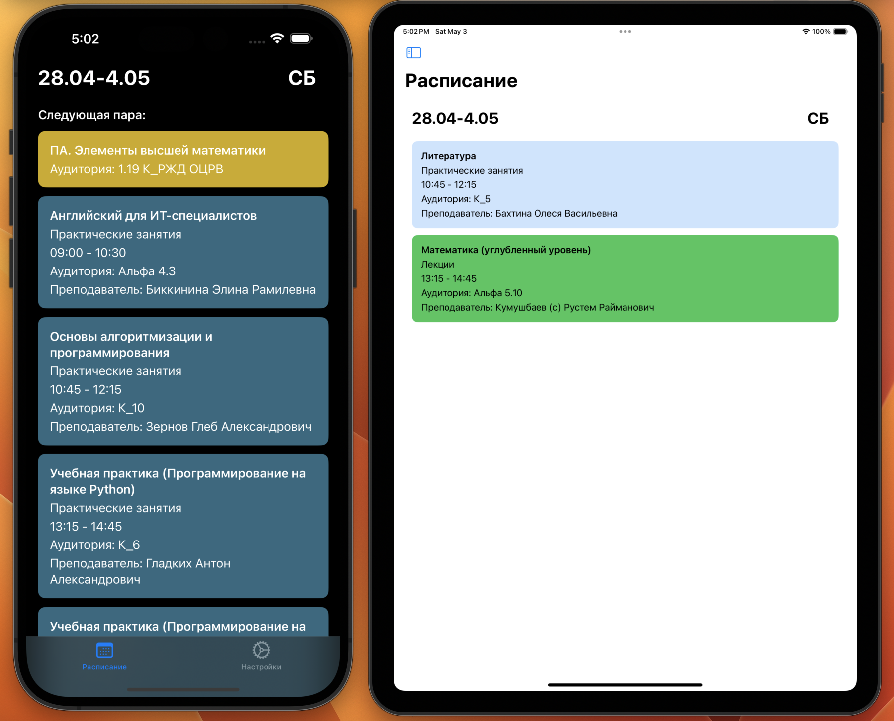
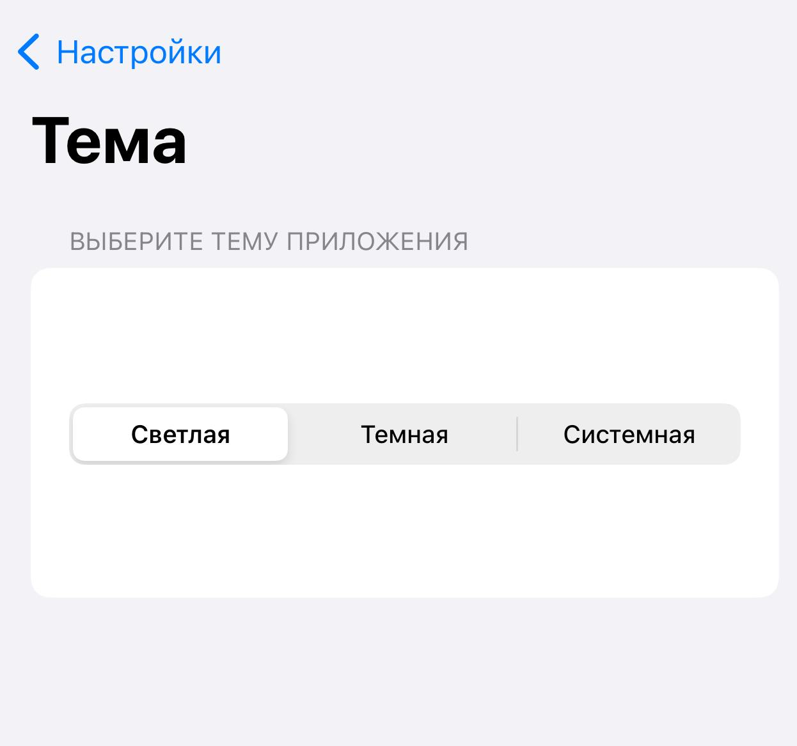
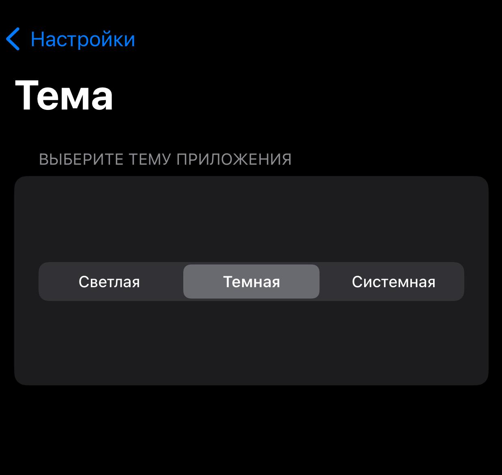
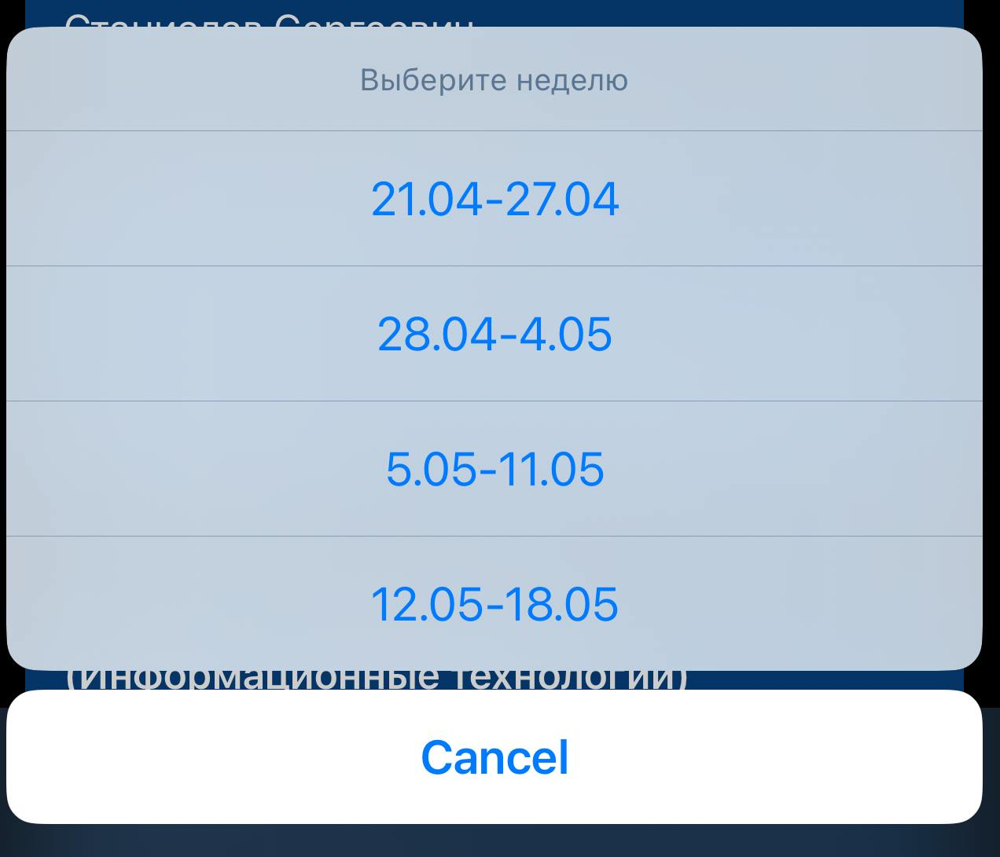
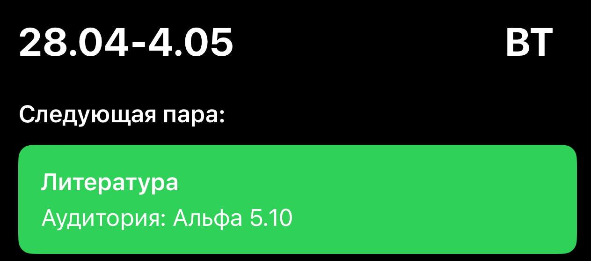

# Sirinium

<p align="center">
  
</p>

Sirinium is a user-friendly iOS application designed to help students and faculty easily view their university schedules.

---

## About the Project

Sirinium provides a seamless experience for accessing and managing academic schedules. It fetches the latest schedule data from an external API and presents it in an intuitive and customizable interface. The app is built with SwiftUI, ensuring a modern and responsive user experience.

---

## Features

<p align="center">
  
</p>

-   **Comprehensive Schedule Viewing:** Easily browse schedules by academic group and specific weeks.
-   **Theme Support:** Choose between light, dark, or system default themes for optimal viewing comfort.
    <p align="center">
      
      
    </p>
-   **Automatic Refresh:** The schedule automatically updates at user-defined intervals to ensure you always have the latest information.
-   **Multi-Week View:** Plan ahead by viewing schedules for several weeks.
    <p align="center">
      
    </p>
-   **Automatic Day Switching:** The app intelligently switches to the next day's schedule after 8 PM.
-   **Next Lesson Display:** Quickly see your upcoming class and its location.
    <p align="center">
      
    </p>
-   **Notification Integration:** Receive timely notifications for your next class. Notification timings are customizable (e.g., 5, 10, 15 minutes before class).
    <p align="center">
      
    </p>
-   **Teacher Filtering:** For subjects like English, filter the schedule by specific teachers.
-   **User-Friendly Interface:** A clean interface with dedicated tabs for viewing the schedule and managing settings.
-   **Settings Customization:**
    *   Select your academic group.
    *   Choose your preferred English language teacher for filtered views.
    *   Set the auto-refresh interval for the schedule.
    *   Configure app theme (Light, Dark, System).
    *   Manage notification preferences.

---

## Technical Stack

-   **SwiftUI:** The app is built using Apple's modern declarative UI framework.
-   **iOS:** Developed for the iOS platform.
-   **External API:** Fetches schedule data from `https://api.eralas.ru/`.

---

## Getting Started

To run Sirinium locally, you will need:
*   Xcode installed on your macOS machine.
*   Knowledge of Swift and SwiftUI.

1.  Clone the repository:
    ```bash
    git clone https://your-repository-url.git 
    ```
    (Replace `https://your-repository-url.git` with the actual URL of this repository)
2.  Open the `sirinium.xcodeproj` file in Xcode.
3.  Select your target device or simulator and run the app.

---

## Contributing

Contributions are welcome! If you have suggestions for improvements or encounter any issues, please feel free to:
1.  Fork the Project.
2.  Create your Feature Branch (`git checkout -b feature/AmazingFeature`).
3.  Commit your Changes (`git commit -m 'Add some AmazingFeature'`).
4.  Push to the Branch (`git push origin feature/AmazingFeature`).
5.  Open a Pull Request.

Alternatively, you can open an issue with the "bug" or "enhancement" tag.

---

## License

Distributed under the MIT License. See `LICENSE.txt` for more information.

*(It is recommended to add a `LICENSE.txt` file to the repository with the full text of the MIT License.)*

---

## Contact and Support

If you have any questions or encounter problems, please open an issue in the repository.
```
